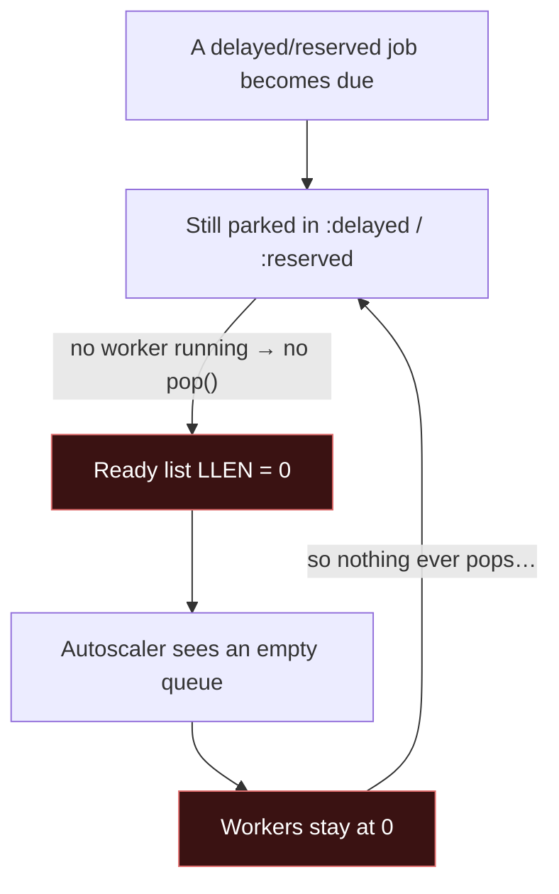
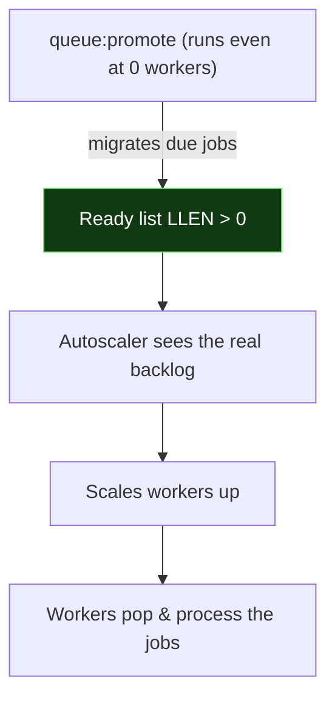

# Queue Promoter

- [Introduction](#introduction)
    - [The Problem](#the-problem)
    - [The Solution](#the-solution)
    - [Driver Compatibility](#driver-compatibility)
- [Installation](#installation)
- [Usage](#usage)
    - [Command Options](#command-options)
- [Running the Promoter](#running-the-promoter)
    - [As a Long-Running Daemon](#as-a-long-running-daemon)
    - [Via the Scheduler](#via-the-scheduler)
- [How It Works](#how-it-works)
- [Testing](#testing)
- [License](#license)

<a name="introduction"></a>
## Introduction

While running Laravel's Redis queue, you may scale your workers down to zero during quiet periods to save resources, trusting your autoscaler to bring them back when work arrives. Unfortunately, with the Redis driver, jobs that become due while no workers are running stay invisible to the metric autoscalers watch — so they never wake the workers back up.

Queue Promoter solves this. It is a `queue:work`-style daemon that promotes **due delayed jobs** and **expired reserved jobs** onto the ready list on its own — without reserving or processing anything — so the queue's length always reflects the real backlog.

<a name="the-problem"></a>
### The Problem

With Laravel's Redis queue driver, not every job lives on the "ready" list:

- **Delayed** jobs (dispatched with `->delay(...)`) wait in a `:delayed` sorted set.
- **Reserved** jobs (already picked up by a worker) sit in a `:reserved` sorted set until they complete or time out.

Typically this is fine: these jobs are migrated onto the ready list the next time a worker calls `pop()`. However, if you scale your workers to zero, nothing calls `pop()`. Due jobs remain parked, and the ready list's length (`LLEN`) — the metric most autoscalers, such as KEDA, rely on — reports `0`. As a result, nothing scales back up, and the jobs are stuck.



In other words, a deadlock: there are no workers because the queue looks empty, and the queue looks empty because there are no workers.

<a name="the-solution"></a>
### The Solution

Run a single `queue:promote` instance alongside your application. On each pass it promotes due jobs onto the ready list — without reserving or running them — so `LLEN` reflects the true backlog and your autoscaler can do its job.



<a name="driver-compatibility"></a>
### Driver Compatibility

> [!NOTE]
> Only the Redis driver needs this package. The `database`, `sqs`, and `beanstalkd` drivers evaluate due-ness at `pop()` time, so they have nothing to promote.

<a name="installation"></a>
## Installation

You may install the package via Composer:

```bash
composer require abdulmajeed-jamaan/laravel-queue-promoter
```

The package's service provider is auto-discovered, so there is no configuration to publish.

<a name="usage"></a>
## Usage

The `queue:promote` command mirrors the signature of Laravel's own `queue:work`:

```bash
# Promote the default Redis connection's default queue, looping every 3 seconds
php artisan queue:promote

# Target a specific connection and queue(s)
php artisan queue:promote redis --queue=high,default
```

If you point the command at a connection that is not backed by Redis, it will fail fast rather than silently do nothing:

```
The [database] queue connection is not backed by Redis; queue:promote only supports Redis queues.
```

<a name="command-options"></a>
### Command Options

Because `queue:promote` extends `queue:work`, the familiar options are available to you:

```bash
# Run a single pass — useful for the scheduler or a pre-scale hook
php artisan queue:promote redis --once

# Tune the loop's sleep interval and lifetime
php artisan queue:promote redis --sleep=1 --max-time=3600
```

<a name="running-the-promoter"></a>
## Running the Promoter

A single promoter instance is enough to keep your ready list accurate. You may run it as a long-running process or let the scheduler drive it.

<a name="as-a-long-running-daemon"></a>
### As a Long-Running Daemon

You may run the promoter under a process monitor such as Supervisor, systemd, or Kubernetes:

```bash
php artisan queue:promote redis --queue=high,default --sleep=1
```

Like `queue:work`, the command handles `SIGTERM` gracefully and respects `queue:restart`, so it is safe to deploy and roll. Be sure to set your `terminationGracePeriodSeconds` (Kubernetes) or `stopwaitsecs` (Supervisor) comfortably above your `--sleep` value.

<a name="via-the-scheduler"></a>
### Via the Scheduler

Alternatively, if you would rather the scheduler own the loop, you may schedule the single-pass form:

```php
use Illuminate\Support\Facades\Schedule;

Schedule::command('queue:promote redis --once')->everyFifteenSeconds();
```

<a name="how-it-works"></a>
## How It Works

Under the hood, the package runs Laravel's **stock** `queue:work` worker, unchanged, against a Redis connection that *promotes instead of reserves*.

Laravel's `RedisQueue::pop()` already migrates due delayed and expired reserved jobs onto the ready list **before** it reserves one. A `PromotingRedisQueue` overrides only that final reserve step to return nothing — so every pass promotes, but the worker is never handed a job to run.

The `queue:promote` command wires this up using public APIs only: it registers a `redis-promoter` connector and points a throwaway connection (a copy of your real connection's configuration) at it, then runs the stock worker against that connection. Your real `redis` connection is never modified, so live `queue:work` workers are completely unaffected. Everything else — the daemon loop, `--sleep`, signal handling, `queue:restart`, pause and resume, `--memory`, and `--max-time` — is the framework's own behaviour. The promoting connection also reports your real connection's name, so pause flags and pop events resolve correctly.

<a name="testing"></a>
## Testing

```bash
composer test
```

The test suite runs against a real Redis-compatible server (Redis or Valkey). See [`.github/workflows/tests.yml`](.github/workflows/tests.yml) for the continuous integration setup.

<a name="license"></a>
## License

Queue Promoter is open-sourced software licensed under the [MIT license](LICENSE.md).
