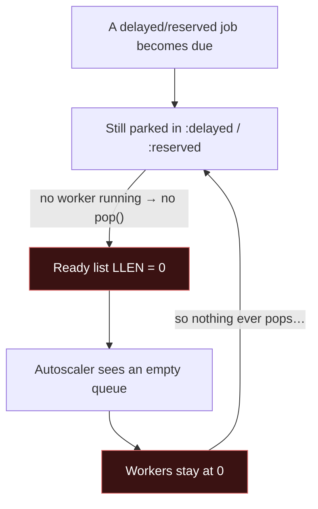
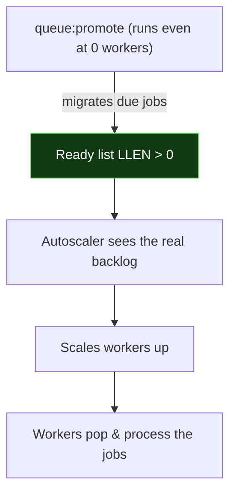

# Laravel Queue Promoter

**Keep your Redis queue's ready count honest — even when workers are scaled to zero — so autoscalers can wake them back up.**

`queue:promote` is a `queue:work`-style daemon that moves **due delayed jobs** and **expired reserved jobs** onto the ready list on its own, without processing anything.

---

## The problem

With Laravel's **Redis** queue driver, jobs aren't always on the "ready" list:

- **Delayed** jobs (`->delay(...)`) wait in a `:delayed` sorted set.
- **Reserved** jobs (picked up by a worker) sit in a `:reserved` sorted set until they finish or time out.

These only get moved onto the ready list when a worker calls `pop()`. That's fine while workers are running — but if you **scale workers to zero**, nobody calls `pop()`, so due jobs stay invisible. The ready list's length (`LLEN`) — the metric most autoscalers (KEDA, etc.) watch — reads **0**, so nothing scales back up. The jobs are stuck.



A deadlock: no workers because the queue looks empty, and the queue looks empty because there are no workers.

## The fix

Run **one** `queue:promote` instance. Each pass it promotes due jobs onto the ready list — without reserving or running them — so `LLEN` reflects the real backlog and your autoscaler does its job.



> [!NOTE]
> **Only the Redis driver needs this.** The `database`, `sqs`, and `beanstalkd` drivers evaluate due-ness at `pop()` time, so there's nothing to promote.

## Installation

```bash
composer require abdulmajeed-jamaan/laravel-queue-promoter
```

The service provider is auto-discovered — no config to publish.

## Usage

`queue:promote` mirrors `queue:work`'s signature:

```bash
# Promote the default Redis connection's default queue, looping every 3s
php artisan queue:promote

# A specific connection and queue(s)
php artisan queue:promote redis --queue=high,default

# A single pass — for the scheduler or a pre-scale hook
php artisan queue:promote redis --once

# Tune the loop
php artisan queue:promote redis --sleep=1 --max-time=3600
```

Pointing it at a non-Redis connection fails fast:

```
The [database] queue connection is not backed by Redis; queue:promote only supports Redis queues.
```

## Deploying it

You need **one** promoter alongside your workers — a single instance is enough.

**As a long-running daemon** (Supervisor, systemd, Kubernetes). It handles `SIGTERM` gracefully and respects `queue:restart`, so it's safe to roll. Set `terminationGracePeriodSeconds` / `stopwaitsecs` comfortably above `--sleep`:

```bash
php artisan queue:promote redis --queue=high,default --sleep=1
```

**Or let the scheduler own the loop** with the single-pass form:

```php
use Illuminate\Support\Facades\Schedule;

Schedule::command('queue:promote redis --once')->everyFifteenSeconds();
```

## How it works

It runs Laravel's **stock** `queue:work` worker, unchanged, against a Redis connection that *promotes instead of reserves*.

`RedisQueue::pop()` already migrates due delayed and expired reserved jobs onto the ready list **before** it reserves one. A `PromotingRedisQueue` overrides just that reserve step to return nothing — so every pass promotes, but hands the worker no job to run.

The `queue:promote` command wires this up through public APIs only: it registers a `redis-promoter` connector and points a throwaway connection (a copy of your real connection's config) at it, then runs the stock worker against that. **Your real `redis` connection is never modified**, so live `queue:work` workers are unaffected. Everything else — the daemon loop, `--sleep`, signal handling, `queue:restart`, pause/resume, `--memory`/`--max-time` — is the framework's own behaviour. (The promoting queue reports your real connection's name, so pause flags and pop events resolve correctly.)

## Testing

```bash
composer test
```

The suite runs against a real Redis-compatible server (Redis or Valkey) — see [`.github/workflows/tests.yml`](.github/workflows/tests.yml) for the CI setup.

## License

The MIT License (MIT). See [LICENSE.md](LICENSE.md).
